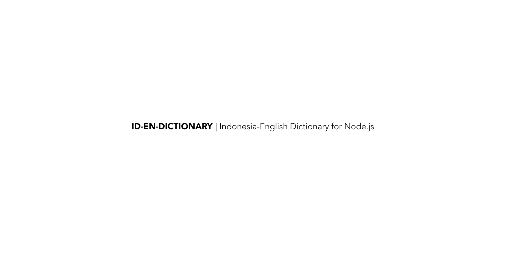

Id-En-Dictonary is a node.js module which makes Indonesian words, their relations and english meanings available as a package.

## About

This packages uses the [Id-Wordnet](https://github.com/open-language/id-wordnet) and [En-Wordnet](https://github.com/open-language/en-wordnet) package to make the words, their meanings and relationships available to your node.js package. It also adds helper functions for other ways to access the information.


## Quick Start

You can install the package via `npm` or `yarn`

```
yarn add id-en-dictionary
```

Once it has been added, you need to initialize the dictionary, like so
```js
const dict = require('./index')

const start = async () => {
    const d = await dict.init()
    const result = d.query('mengerti')
    console.log(result)
}

start()
```

The dictionary can take about 4000ms to load the data in memory, it doesn't use an external database/redis yet (nor is that planned, since most queries take under 1ms, and the underlying data doesn't changes probably once a year)

```txt
query-mengerti: 1ms
dictionary.init: 3960ms (this is because it loads id-wordnet and en-wordnet into memory)
```

### Query words

You can query for a single word with this syntax. If you want to use multiple words, replace the ` ` with `_`.
```js
let result = dict.query('mengerti')
```

Here's a sample outlet that you can expect for the queries above

```json
{
  "588221": {
    "offset": 588221,
    "pos": "verb",
    "language": "Bahasa msa",
    "lemma": "mengerti",
    "words": "mafhum, memafhumi, memahami, menambang, menangkap, mencekam, mencekau, mencengkam, mencungkil, mengarifi, mengarifkan, mengerti, menggayuk, menggerai, mengorek, mengorok, menjabat, faham",
    "glossary": [
      "get the meaning of something",
      "\"Do you comprehend the meaning of this letter?\""
    ],
    "englishWords": [
      "grok",
      "get_the_picture",
      "comprehend",
      "savvy",
      "dig",
      "grasp",
      "compass",
      "apprehend"
    ]
  },
  "588888": {
    "offset": 588888,
    "pos": "verb",
    "language": "Bahasa msa",
    "lemma": "mengerti",
    "words": "mafhum, maklum, memafhumi, mengarifkan, mengetahui, memahami, memaklumi, mengarifi, mengerti, mengartikan, faham, reti",
    "glossary": [
      "know and comprehend the nature or meaning of",
      "\"She did not understand her husband\"",
      "\"I understand what she means\""
    ],
    "englishWords": [
      "understand"
    ]
  },
  "589738": {
    "offset": 589738,
    "pos": "verb",
    "language": "Bahasa msa",
    "lemma": "mengerti",
    "words": "memahami, mengerti, faham",
    "glossary": [
      "grasp the meaning",
      "\"Can you follow her argument?\"",
      "\"When he lectures, I cannot follow\""
    ],
    "englishWords": [
      "follow"
    ]
  },
  "589904": {
    "offset": 589904,
    "pos": "verb",
    "language": "Bahasa msa",
    "lemma": "mengerti",
    "words": "kian, menghidap, berjangkit, beroleh, memahami, membawa, memperoleh, menangkap, mendapat, mendapati, mendapatkan, mengambil, mengerti, meringkus, mengantongi",
    "glossary": [
      "grasp with the mind or develop an understanding of",
      "\"did you catch that allusion?\"",
      "\"We caught something of his theory in the lecture\"",
      "\"don't catch your meaning\"",
      "\"did you get it?\"",
      "\"She didn't get the joke\"",
      "\"I just don't get him\""
    ],
    "englishWords": [
      "catch",
      "get"
    ]
  },
  "590366": {
    "offset": 590366,
    "pos": "verb",
    "language": "Bahasa msa",
    "lemma": "mengerti",
    "words": "memahami, mengerti",
    "glossary": [
      "understand, usually after some initial difficulty",
      "\"She didn't know what her classmates were plotting but finally caught on\""
    ],
    "englishWords": [
      "catch_on",
      "get_wise",
      "get_onto",
      "tumble",
      "latch_on",
      "cotton_on",
      "twig",
      "get_it"
    ]
  },
  "591115": {
    "offset": 591115,
    "pos": "verb",
    "language": "Bahasa msa",
    "lemma": "mengerti",
    "words": "mafhum, maklum, melaksanakan, melihat, memafhumi, memaklumi, membayangkan, menerawang, mengarifkan, menginsafi, menjelmakan, menyaba, mewujudkan, nampak, ingat, memahami, mengarifi, mengerti, mengartikan, menyadari, faham, menaruh_mata, reti, taakul, ternampak-nampak",
    "glossary": [
      "perceive (an idea or situation) mentally",
      "\"Now I see!\"",
      "\"I just can't see your point\"",
      "\"Does she realize how important this decision is?\"",
      "\"I don't understand the idea\""
    ],
    "englishWords": [
      "understand",
      "realize",
      "realise",
      "see"
    ]
  },
  "593522": {
    "offset": 593522,
    "pos": "verb",
    "language": "Bahasa msa",
    "lemma": "mengerti",
    "words": "mafhum, maklum, memafhumi, memaklumi, menamatkan, mengakhiri, mengarifi, mengarifkan, mengerti, menyimpulkan, mereka-reka, rasa, mengartikan, faham",
    "glossary": [
      "believe to be the case",
      "\"I understand you have no previous experience?\""
    ],
    "englishWords": [
      "understand",
      "infer"
    ]
  },
  "593852": {
    "offset": 593852,
    "pos": "verb",
    "language": "Bahasa msa",
    "lemma": "mengerti",
    "words": "dengar, mafhum, maklum, memafhumi, memahami, memaklumi, membaca, menanggapi, mengarifi, mengarifkan, mengerti, menginterpretasikan, menafsirkan, menerjemahkan, mengartikan, terjemah, kefahaman, mentaksirkan, menterjemahkan",
    "glossary": [
      "make sense of a language",
      "\"She understands French\"",
      "\"Can you read Greek?\""
    ],
    "englishWords": [
      "understand",
      "read",
      "interpret",
      "translate"
    ]
  },
  "594058": {
    "offset": 594058,
    "pos": "verb",
    "language": "Bahasa msa",
    "lemma": "mengerti",
    "words": "mafhum, memafhumi, mengarifi, mengarifkan, bersimpati, maklum, memahami, memaklumi, mengerti, mengartikan, bertimbang_rasa, faham, reti",
    "glossary": [
      "be understanding of",
      "\"You don't need to explain--I understand!\""
    ],
    "englishWords": [
      "sympathize",
      "sympathise",
      "empathize",
      "empathise",
      "understand"
    ]
  },
  "624476": {
    "offset": 624476,
    "pos": "verb",
    "language": "Bahasa msa",
    "lemma": "mengerti",
    "words": "berhasil, jadi, makan, memahami, memasukkan, membaca, membawa, membutuhkan, mengambil, menganggap, mengarik, mengerti, meluwengkan, mentafsirkan",
    "glossary": [
      "interpret something in a certain way",
      "convey a particular meaning or impression",
      "\"I read this address as a satire\"",
      "\"How should I take this message?\"",
      "\"You can't take credit for this!\""
    ],
    "englishWords": [
      "take",
      "read"
    ]
  },
  "728617": {
    "offset": 728617,
    "pos": "verb",
    "language": "Bahasa msa",
    "lemma": "mengerti",
    "words": "melaksanakan, mengarifi, mengarifkan, mengenal, mengerti, menginsafi, menjelmakan, mewujudkan, memaklumi, mengakui, menyadari, mengiktiraf, menyedari, sedar",
    "glossary": [
      "be fully aware or cognizant of"
    ],
    "englishWords": [
      "recognize",
      "recognise",
      "realize",
      "realise",
      "agnize",
      "agnise"
    ]
  },
  "2106506": {
    "offset": 2106506,
    "pos": "verb",
    "language": "Bahasa msa",
    "lemma": "mengerti",
    "words": "mafhum, melihat, memafhumi, memahami, menangkap, mencerap, menganggap, mengarifkan, nampak, mengarifi, mengerti, merasa, faham, mempersepsi, menyedari",
    "glossary": [
      "to become aware of through the senses",
      "\"I could perceive the ship coming over the horizon\""
    ],
    "englishWords": [
      "perceive",
      "comprehend"
    ]
  }
}
```

## Is this credible?

We currently rely [Bahasa Wordnet](http://wn-msa.sourceforge.net/index.eng.html) and Version 3.0 of [Princeton University's Wordnet](https://wordnet.princeton.edu/). Both of these are probably the most well know open wordnets. You can find other [open wordnets here](http://compling.hss.ntu.edu.sg/omw/)

## Credits

- [TJ Holowaychuk](https://github.com/tj) for showing us how to use black and white beautifully to create the image on the top of the readme. Inspiration from [apex/up](https://github.com/apex/up)
- [Bahasa Wordnet](http://wn-msa.sourceforge.net/index.eng.html) and [Princeton Univerysity's Wordnet](https://wordnet.princeton.edu/) for bringing so much sanity in the world